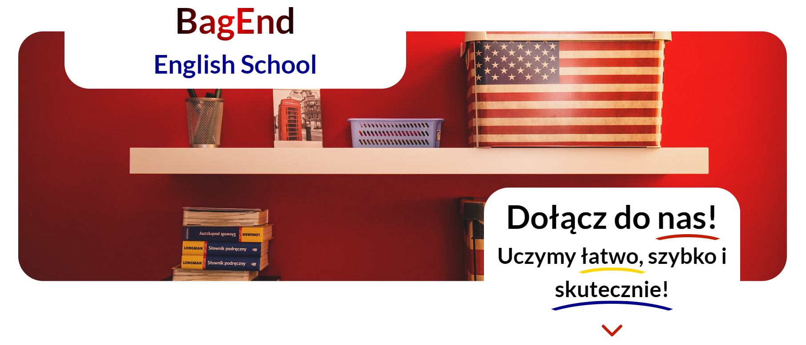

<h1 align="center">BagEnd - English School</h1>
<p>
  
</p>

> This website is for small polish English language teaching company.

### About The Project

I wanted to do simple and convenient for the user webpage. 

Link to project: https://bagend.netlify.app/

## Repository

```sh
https://github.com/jesiennart/BagEnd.git
```
## Technologies Used


## Features

<ul>
<li>Simple website</Li>
<li>Transparent and user-friendly</Li>
<li>Form Validation in js</Li>
</ul>

## Screenshots



## Project Status

In progress.

## Room for Improvement

<ul>
<li>I think about form to booking lessons</Li>
</ul>

## Acknowledgements

This project was inspired by my wife who is english teacher. She needs simple and user-friendly page for her english teaching school. 

## Author

👤 **Artur Molenda**

* Github: [@jesiennart](https://github.com/jesiennart)

## Contact

Email: artmol@op.pl

